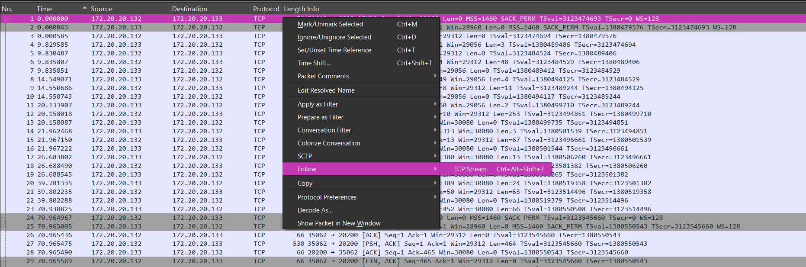
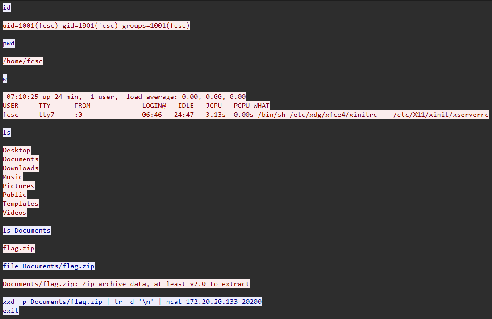
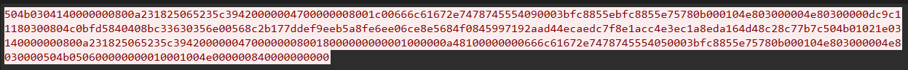

# Solution to Cap ou Pcap

Based on the title and the file we get, we know we are going to work with a packet capture. I'm going to use Wireshark to analyse the file since it's one of the best tool for reading and analysing pcap file, but you're free to use any tool you want.

## Analysing the file with Wireshark

When we open the file in Wireshark, we see a few lines of trafic with TCP protocol. What we can do is take a line (we can take the first one for example), and then:
Right click -> Follow -> TCP Stream

It opens a new window containing all of the trafic decoded so it's much easier to read and understand:

This is a list of command and output executed, and we see that the `flag.zip` is mentionned. When we look at the `xdd` command specifically, we understand that the file `flag.zip` was sent to the IP `172.20.20.133` on port `20200`.

## Getting the Flag

Now, we can take a line of this trafic on port 20200 and do the same thing again: Right click -> Follow -> TCP Stream. 

> **WARNING**: When you followed the first TCP stream, Wireshark added a filter, which means you won't see your lines on port `20200` ! You need to remove the filter first, on the little green bar at the top of the screen.

This opens a new window containing some new information:

Even if this could look like random data, we know that it's the `flag.zip` file being transfered, so we have to take those bytes and write them in a zip file to retreive the file !

I'm using Python for this, you can use the `bytes.fromhex()` function to transform the hex string to bytes. Then, to write the bytes in a file, we can use the `open()` function to write in a file called `flag.zip`. Dont forget to use the tag `wb` and not `w` since you want to write bytes !

Then, your zip file will be created so you just have to extract the data and read the `flag.txt` file !

Here's the Flag: `FCSC{6ec28b4e2b0f1bd9eb88257d650f558afec4e23f3449197b4bfc9d61810811e3}`