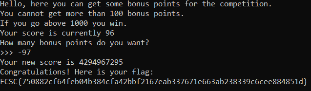

# Solution to Bonus Point

This challenge is a basic pwn exploit and doesn't even require to decompile the binary or anything.

When we launch the program, we can see that it asks us to ask for points, add it to our current amount of points without allowing us to go over 100, then, if we have over 1000 somehow, we win !

This is a very simple vulnerability based on unsigned integer.

The concept is quite simple, since the integer isn't signed (it doesn't have a sign: positive or negative), if the int goes to 0, instead it'll go to back at the maximum value `0xffffffff`.

So when the program asks for the amount of points we want to add, we give it a negative number to have our points go below 0, and then get our flag !

And here's the flag: `FCSC{750882cf64feb04b384cfa42bbf2167eab337671e663ab238339c6cee884851d}`