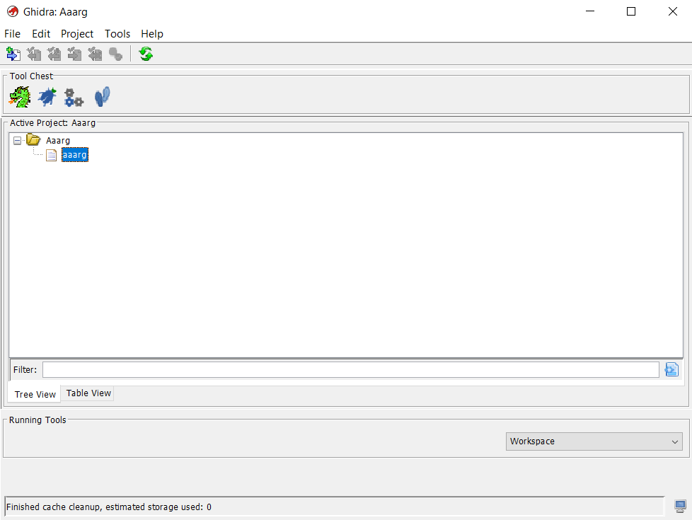
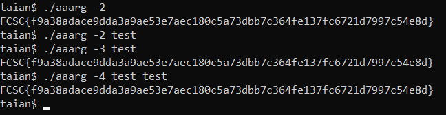

# Solution to Aaarg

## What are we looking at ?

The file `aaarg` that we have to download doesn't have an extension, which means we probably have a **binary file** (makes sense in reverse engineering).

*In Windows, by default it'll try to save the file in `.txt` so be careful to save it as a binary !*


We can simply verify what type of file we have using the command `file aaarg` and we get this output:
`aaarg: ELF 64-bit LSB executable, x86-64, version 1 (SYSV), dynamically linked, interpreter /lib64/ld-linux-x86-64.so.2, for GNU/Linux 3.2.0, BuildID[sha1]=f5b07c01242cc5987bed7730c2762ae0491b5ddc, stripped`

The file is an "ELF 64-bit LSB executable" so it confirms that it's a executable file for linux.


## What do we do from now ?

Since it's just an intro challenge, we can try some very simple things, like looking at the content of the file or printing the strings.

You can use commands like `cat` or `string` to accomplish that, but you'll see that we get nothing from it.

Our only option seems to be to decompile our file, I'm going to use Ghidra but you're free to use any tool you like !


## Decompiling in Ghidra

Using Ghidra, you first create a new project, select the folder where you want to get your result, and then you drag and drop the file.

Ghidra is going to show you a quick summary that you can close. You should end up with something looking like this:



Then, double click on `aaarg`, Ghidra is going to ask you if you want to analyse the file, click "Analyse" and you're finally facing the decompiled code of the file.


## Understanding the decompiled code

When we look in the list of functions (one of the menu on the left), we see a function called `entry`.

This is usually the function called when the program is started, so we can take a look.

The `entry` function makes a call to `__libc_start_main` which is a function that launches the `main` function.

So, we can deduce that the function called `FUN_00401190` is our `main` function !

To facilitate the reading of the code, you can go in the list of functions, right click on `FUN_00401190` and rename it to "main".

Now we can click on the `main` function and look at what it does:

```
undefined8 main(int param_1,long param_2)

{
  undefined8 uVar1;
  ulong uVar2;
  char *local_10;
  
  uVar1 = 1;
  if (1 < param_1) {
    uVar2 = strtoul(*(char **)(param_2 + 8),&local_10,10);
    uVar1 = 1;
    if ((*local_10 == '\0') && (uVar1 = 2, uVar2 == (long)-param_1)) {
      uVar2 = 0;
      do {
        putc((int)(char)(&DAT_00402010)[uVar2],stdout);
        uVar2 = uVar2 + 4;
      } while (uVar2 < 0x116);
      putc(10,stdout);
      uVar1 = 0;
    }
  }
  return uVar1;
}
```

So the main function takes two arguments, param 1 and 2, one being an integer and the other one a long.

It declares 3 variables, then checks if `param_1` is more than 1, otherwise it won't do anything.

To understand better what's going to happen next, it's important to understand what `param_1` and `param_2` are.

## What are the parameters ?

By default, in C language, the main function is going to take those 2 parameters:
* `param_1`: the amount of arguments given
* `param_2`: the list of all arguments given

Let's look at an example:
* `./myprogram hello` --> `param_1 = 2, param_2 = [./myprogram, hello]`
* `./myprogram 1 2 3` --> `param_1 = 4, param_2 = [./myprogram, 1, 2, 3]`

In our case, we can see that `param_2` is declared as a long, but this is probably due to the decompilation which is just an approximation of the source code, but not the real source code. Especially here, since the decompilation didn't recognize the main function itself, it probably explains why we have those differences in types.

Now that we understand that, the rest is going to be easy !

## How do we finally get the flag ?

So first we check if we have at least 2 arguments (`if (1 < param_1)`), then we use the `strtoul` function which is going to convert a string to the long value.
`strtoul` stands for "String to unsigned long", and without going to much into details, it's going to return the value of the number inside the string and store the rest.

Example: if we do `strtoul` of the string `123abc`, `123` will be assigned to `uVar2` in base 10 (because of the last argument), and `abc` will be stored inside `&local_10`.

In our case, we can see that we look at `param_2 + 8`. This is due to the decompilation again, but it is equivalent to looking at the second element of the array.
In other words, `param_2 + 8` will be equivalent to `param_2[1]`, `param_2 + 16` would be `param_2[2]` etc.

We understand that we have to give at least one argument and it has to be a number that will be store in `uVar2`, but that's not enough !

Finally, we do a double check:
* `(*local_10 == '\0')` checks that we gave a number to the program and not a string (`*local_10` have to be empty)
* `(uVar1 = 2, uVar2 == (long)-param_1))` assigns the value 2 to `uVar1` (not relevant) and checks that `uVar2` is equal to minus the amount of arguments we gave it.

If you remember correctly, `uVar2` was the value of the second argument you gave, so it has to be minus the amount of the total argument you gave to the program.

If you verify that condition, you enter the next step of the code which will simply go through some data and print it's content, the flag !

In fact, you could have dumped the data and directly read the flag in memory but I decided to do it that way instead because I feel like it's the way the creator wanted us to do it.

Some solution could then be:
* `./aaarg -2` (2 arguments, second one is -2)
* `./aaarg -4 test test` (4 arguments, second one is -4)
* etc

We can try:



And we finally get the flag: `FCSC{f9a38adace9dda3a9ae53e7aec180c5a73dbb7c364fe137fc6721d7997c54e8d}`
