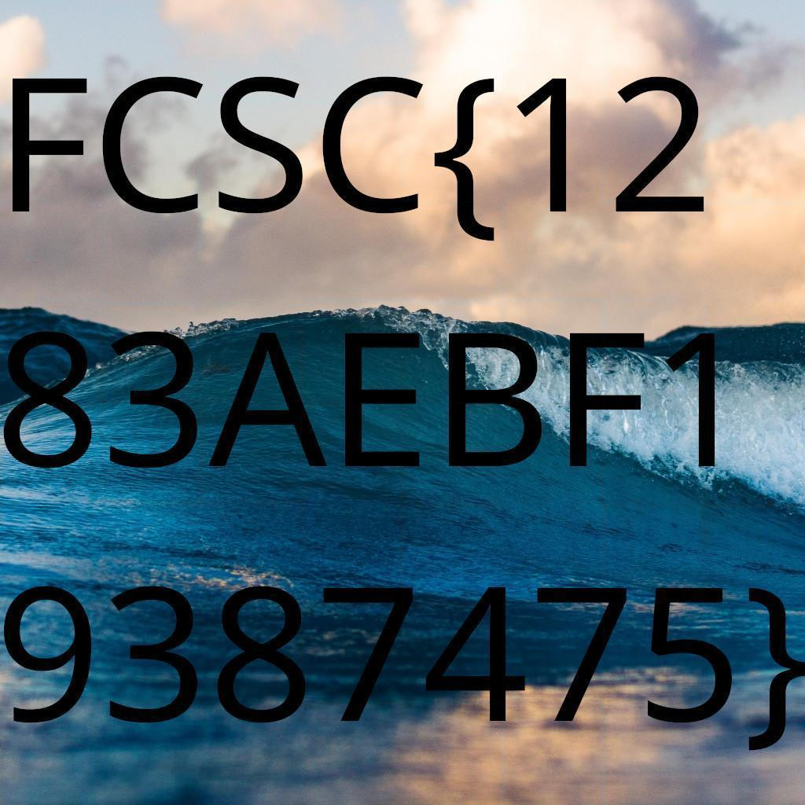

# Solution to Puzzle Trouble 1/2

It's quite easy to understand how to solve this challenge, but it's very tedious to do:

Like everyone else during the event, I used Photoshop to cut the tiles and move them to get the flag. But later, I used that as an excuse to learn Tkinter and made a simple App using Python. You can find the app [here](https://github.com/TaianRmos/tiled-image-scrambler-unscrambler) !

With this, I was able to solve the image:

And read the flag: `FCSC{1283AEBF19387475}`