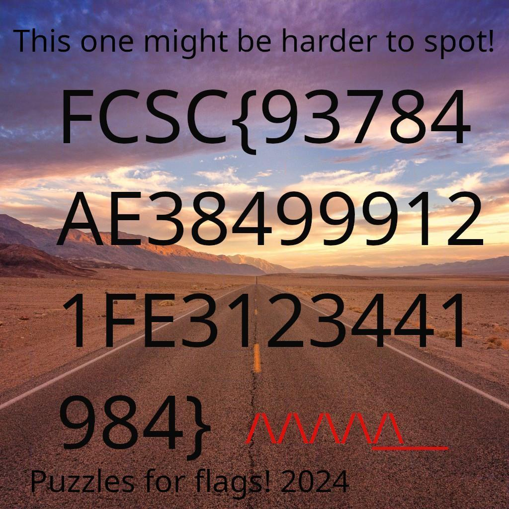

# Solution to Puzzle Trouble 2/2

Like the first version of this challenge, it's quite easy to understand how to solve this, but it's very (very) tedious to do:

Like everyone else during the event, I used Photoshop to cut the tiles and move them to get the flag. But, I got taunt by the meme they put in the description of the challenge, so I used that as an excuse to learn Tkinter and made a simple App using Python. You can find the app [here](https://github.com/TaianRmos/tiled-image-scrambler-unscrambler) !

With this, I was able to solve the image:

And read the flag: `FCSC{93784AE384999121FE3123441984}`