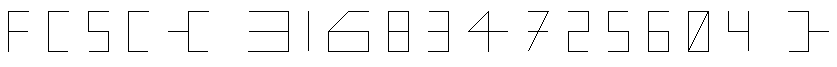

# Solution to Tortuga

I think the python file is quite self-explanatory, but let's break it down because why not:

* First we retreive the two sequence from the text files

* I chose to hide the turtle but it's optional, and set the screen size to `(400, 600)`

* I move the turtle to the left so the whole flag will be visible on the screen

* Then, for each move of the sequence, we want to move the turtle from it's current position to the next. Exception made when the move is `(0, 0)` because this special move indicates that we have to stop writing and move to the next position before writing something again.

For every move, we start from the current position of the turtle, then add the move's `x` and `y` amount, multiplied by an amount of pixels (here 20), or else the turtle will move by 1 or 2 pixels each time and we won't be able to read the flag. On the `y` coordinates, we substract instead of adding because for some reasons the flag is upside down otherwise.

And here's the result:

And we can clearly read the flag: `FCSC{316834725604}`
