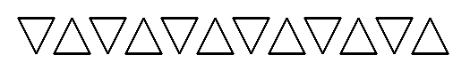
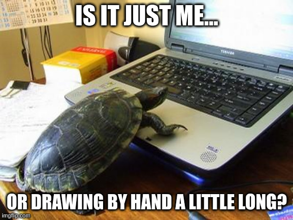

# Tortuga

<pre>
Difficulty: &#11088
</pre>

On vous propose une séance de dessin !

Le fichier `tortuga-flag.txt` contient le flag dessiné uniquement à l'aide de segments.

La méthode pour encoder ces segments est simpliste. On fixe un point de départ `P(x, y)` initialisé à un point quelconque dans le plan, par exemple `(0, 0)`. Puis, chaque élément `(dx, dy)` dans la liste `L` fournie dans le fichier `tortuga.txt` permet d'atteindre un nouveau point `Q(x + dx, y + dy)` et le segment `PQ` est tracé entre ces deux points. Une fois ce segment tracé, le point courant `P` est remplacé par le point `Q`, et ce procédé est itéré sur tous les éléments de la liste.

Afin d'autoriser plusieurs symboles, la valeur spéciale `(0, 0)` pour `(dx, dy)` est utilisée pour déplacer le point `P` comme décrit ci-dessus avec l'élément suivant de la liste, mais aucun segment n'est tracé.

On donne l'exemple suivant (`tortuga-example.txt`) où le point initial `P` est choisi tout en haut à gauche.

```
[
	# Draw triangle pointing down (drawn clockwise)
	(2, 0), (-1, 2), (-1, -2),
	# Skip
	(0, 0), (3, 0),
	# Draw triangle pointing up (drawn counterclockwise)
	(-1, 2), (2, 0), (-1, -2),
	# Skip
	(0, 0), (1, 0),
] * 6
```

Et l'image associée :



Note : le flag est de la forme `FCSC{[0-9]+}`.


