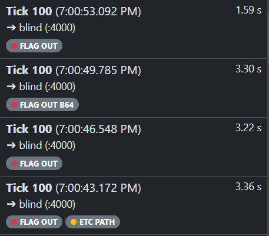
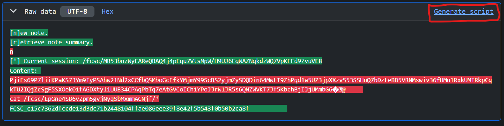

# Solution to Blind Attack

This challenge was quite confusing to me at start but ended up to be very simple.

## Understanding what we have

Based on the given information, we have to use the tool Shovel to reproduce the attacks and retreive the enemy flag.

We start the docker, and we can connect to the shovel tool on `http://localhost:8000`.

From there, we have a bunch of logs, with a lot of information, and we can see that some logs indicate that a flag was given to the ennemy with the command shown.

## Getting the Flag

From there, we know that we have to reproduce the attacks to get a flag. So we can take one attack that went through (for example the first one), and then use the "Generate script" button to create a script that will reproduce the attack.

From there, you get a Python script that you can just copy paste and adapt.

You have to change two things:
* The `HOST` variable, that should be equal to your localhost `HOST = "127.0.0.1"`
* The flag id that you have to replace by the one given: `/fcsc/ddJ565eGcAPFVkHZZFqXtrYe2vmVUQv`

Launch the script and get your Flag: `FCSC_47d5ba1574be11ecbbfdcfac58fa8e8dcc8f010894f79b8615e4d746bc857d80`